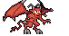
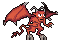
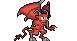
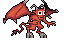
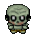
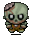
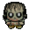
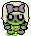

# ZOMBIES AND DEMONS

## Introducción

El apocalipsis ha llegado repentinamente para arrasar con todo. Ninguna predicción hacía creer que esto iba a suceder de esta forma. Científicos y lideres del mundo no pueden explicar los acontecimientos que se viven en la Tierra. La sociedad, los estados y las economías del mundo caen producto de una una plaga de zombies y demonios que devora a la humanidad a pasos agigantados. Según lo informado un portal irrumpió en el cielo haciendo brotar miles de demonios que al morder a los humanos los convertían en zombies. 
Los días pasan y cada vez mas gente llega a los centros de trasbordo que han organizado los paises para resistir y ganar tiempo. Las potencias aeroespaciales coordinan sus fuerzas para evacuar a la mayor cantidad de personas posibles. 
Es hora de sobrevivir a este caos ¿pero cómo?. Todavía no lo sé. Encima estoy rodeado por estos monstruos que deambulan sin rumbo por las cercanías de mi casa. Me queda poca comida y agua. Ya no hay electricidad hace una semana. Debo partir hacia la autopista para poder encontrar algun vehiculo.

## Personaje principal

Totalmente atemorizado deambulas sin saber a donde ir. Te espera una travesía muy dura en búsqueda de sobrevivir un día más.

## Enemigos

### Demonios 

Estos Malditos demonios iniciaron el apocalipsis. No te enfrentes a ellos son muy poderosos

           

### Zombies

Estos monstruos alguna vez fueron humanos. Ahora tienen el mismo comportamiento que los demonios.

                      

