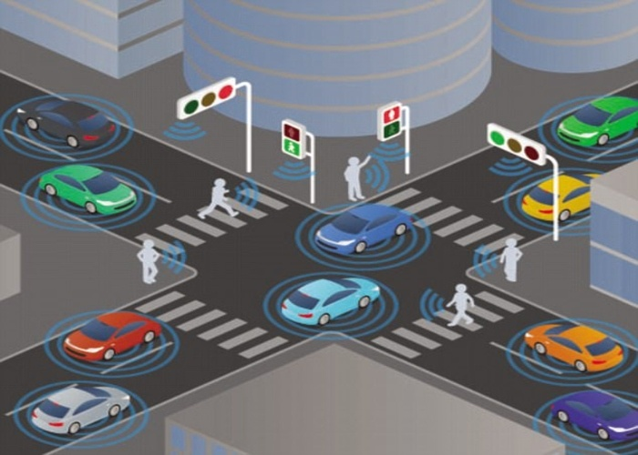

# Colisiones y el Sistema de Prioridades

## Un vistazo a las colisiones
Dada la estructura del juego, donde cada elemento (jugador, valla, zombie, etc) es un objeto que se almacena en una coleccion en comun con todos los demas objetos, se puede hacer que todos estos "colisionen" mutuamente cuando sus posiciones son equivalentes, esto se puede lograr sencillamente como se muestra en el ejemplo a continuacion:

``` wollok
object zombie1 {
	method colisionar(otroElementoDelJuego) {
		/* codigo a ejecutar cuando el zombie1 colisiona con otro elemento */
	}
}
```

``` wollok
/* almacenamos todos los elementos del nivel en objetos. */
var objetos = [zombie1, zombie2, muro, jugador]

/* Llamamos al metodo para lograr que colisionen mutuamente entre todos. */
fisicas.colisionesEntreTodos(objetos)
```


``` wollok
object fisicas {
	method colisiones(objeto) {
		game.onCollideDo(objeto, {algo => algo.colisionar(objeto)})
	}

	method colisionesEntreTodos(objetos) {
		objetos.forEach({ unObjeto => self.colisiones(unObjeto) })
	}
}
```
Cuando un elemento1 colisiona con otro elemento2, se ejecutan el metodos `elemento1.colisionar(elemento2)` y `elemento2.colisionar(elemento1)`, ¡¡Hemos logrado que se colisionen los elementos!!... pero peroo perooooo como te habras percatado esto tiene un problema, si no lo has visto te lo explico facil; supongamos que nuestro juego tiene zombies y muros, el metodo `zombie.colisionar()` hace que este mate al otro elemento y el metodo `muro.colisionar()` hace que el zombie no pueda seguir avanzando. Una solucion a este problema seria implementar una logica semejante al de un semaforo, el cual solo deje ejecutar el metodo `colisionar()` de un solo elemento de los dos que colisionaron (el de los muros, ya que frena al zombie).



## Adentrándonos en el Sistema de Prioridades
Como habiamos mencionado, es necesario implementar un sistema semejante al de los semaforos en un cruze de trafico, para ello podemos aplicar una logica secilla: darles diferentes prioridades a los elementos del juego y al colisionarse, se ejecuta el metodo `colisionar()` del elemento que tenga mayor prioridad y no se ejecuta completamente el metodo del otro elemento:

``` wollok
object zombie1 {
	/* establecemos que la prioridad del zombie1 es 40. */
	method prioridad() = 40

	override method colisionar(otroElementoDelJuego) {
		/* codigo para hacer que otroElementoDelJuego muera */
	}
}

object muro {
	/* establecemos que la prioridad del muro es 70. */
	method prioridad() = 70
 
	override method colisionar(otroElementoDelJuego) {
		/* codigo para hacer que otroElementoDelJuego se frene */
	}
}

```
Tambien debemos hacer el siguiente cambio en el objeto fisicas:
``` wollok
object fisicas {
	method colisiones(objeto) {
		game.onCollideDo(objeto, {otroObjeto =>
		
			/* Si ambos objetos tienen el mismo nivel de prioridad, no se "colisionan" */
			if (objeto.prioridadColisiones() != otroObjeto.prioridadColisiones()) {
				/* se ejecuta el colisionar del objeto con mayor prioridad. */
				if (objeto.prioridadColisiones() > otroObjeto.prioridadColisiones()) { 
					objeto.colisionar(otroObjeto)
				} else {
					otroObjeto.colisionar(objeto)
				}
			}

		})
	}

	method colisionesEntreTodos(objetos) {
		objetos.forEach({ unObjeto => self.colisiones(unObjeto) })
	}
}
```

Y uala, ¡¡ya tenemos nuestro Sistema de Prioridades funcionando!!, como el muro tiene 70 de prioridad y el zombie1 tiene 40, se ejecutara `muro.colisionar(zombie1)`, esto no solo nos permite que un elemento tenga mayor prioridad a la hora de colisionarse con otro, sino que tambien nos permite hacer que un objeto ignore a otro poniendoles el mismo nivel de prioridad.

__Disclaimer: los codigos mostrados en este documento son simplificados y pueden estar un poco diferentes en el juego ya que solo tienen el objetivo de lograr que el lector tenga un mejor entendimiento de las mecanicas.__
